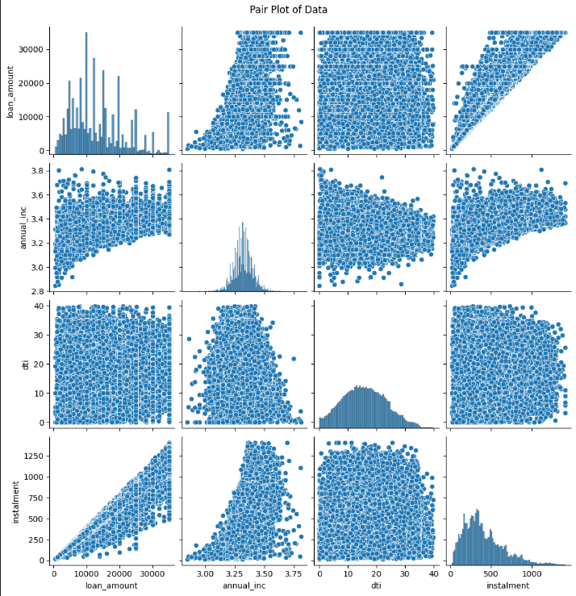
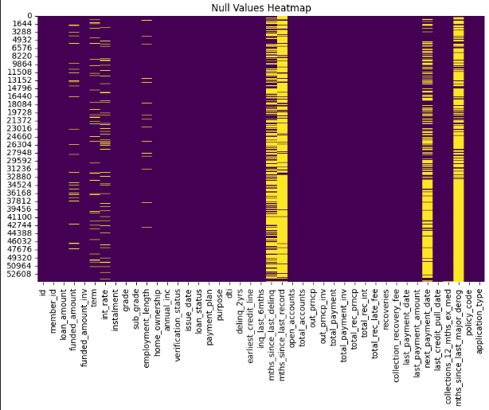
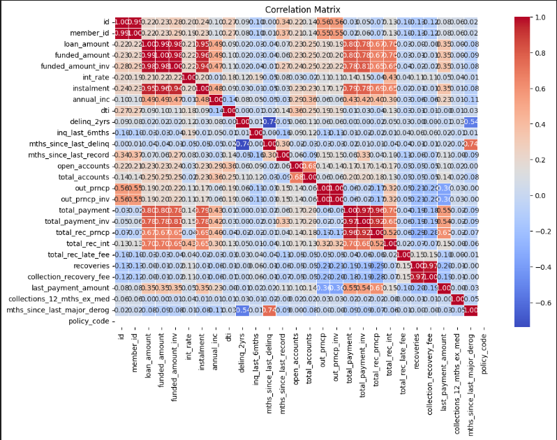

# Project Title: Exploratory Data Analysis - Customer Loans in Finance

## Table of Contents
- [Description](#description)
- [Installation](#installation)
- [File Modules](#file-modules)

## Description
As an aspiring data analyst and recent biochemistry graduate with a 2.1, I am currently enrolled in the Aicore program, where I am actively honing my skills in practical applications of AI and Data. My goal for this project is to conduct a comprehensive Exploratory Data Analysis (EDA) on the loan portfolio of a significant financial institution.

Project Overview:
In my current role, managing loans is a critical aspect of business operations. To ensure informed decisions about loan approvals and efficient risk management, I am tasked with gaining a comprehensive understanding of the loan portfolio data through EDA. This involves using various statistical and data visualization techniques to uncover patterns, relationships, and anomalies within the loan data.

Key Objectives:

Informative Decision-Making: My aim is to enable the business to make more informed decisions about loan approvals, pricing, and risk management based on the insights derived from the EDA.

Risk and Return Analysis: I will conduct a thorough analysis of the risk and return associated with the business' loans to facilitate better risk management practices.

Performance Enhancement: The ultimate goal is to improve the overall performance and profitability of the loan portfolio by identifying areas of improvement and optimization.

Project Workflow:
The project involves the following key steps, which I will personally oversee:

Data Collection: Gather loan portfolio data from the financial institution's database.

Data Exploration: Perform initial exploration of the data to understand its structure, quality, and characteristics.

Statistical Analysis: Utilize statistical techniques to analyze key metrics, identify trends, and assess risk factors.

Data Visualization: Create visualizations to effectively communicate insights and patterns discovered during the analysis.

Outlier Handling: Address outliers in the data to ensure robust and accurate analysis.

Data Skewness Correction: Normalize data skewness to enhance the reliability of statistical inferences.

ML Algorithm Preparation: Prepare the data for Machine Learning algorithms by optimizing features and addressing data intricacies.

Payment Forecasting: Visualize future payments to provide a predictive understanding of the loan portfolio's financial trajectory.

Correlation Analysis: Explore correlations between user data parameters and loan payment outcomes.

Decision Support System: Develop a decision support system that empowers the business with actionable insights for loan approvals, pricing, and risk management.

Here are some examples of the visualization produced: 

Expected Impact:
By the end of this project, I anticipate delivering a robust Exploratory Data Analysis that not only uncovers valuable insights within the loan portfolio data but also serves as a foundation for improved decision-making processes. My efforts aim to contribute significantly to the business's ability to manage loans effectively, enhance performance, and optimize profitability.

## Installation
pip install -r requirements.txt
## File Modules
1. data_transform.py provides methods to convert date, numeric, and categorical columns in a given DataFrame while also removing excess symbols from specified columns. It facilitates comprehensive data preprocessing for improved analysis and modeling
2. eda_classes.py offers a method to visualize null values in a DataFrame using a heatmap. It provides functions to check, drop columns, and impute null values in a DataFrame, with options for different imputation strategies for numeric and non-numeric columns.
3. eda_skewed.py contains methods for identifying and reducing skewness in numeric columns, removing outliers, and saving a copy of the DataFrame to a CSV file. Also includes functions for visualizing outliers, skewness, data transformations, and creating a pair plot of the data.
4. data_frame_info.py provides methods for retrieving information about the DataFrame, including data types of columns, statistical values, the count of distinct values for categorical columns, the shape of the DataFrame, the count of null values, and the percentage of null values for each column.